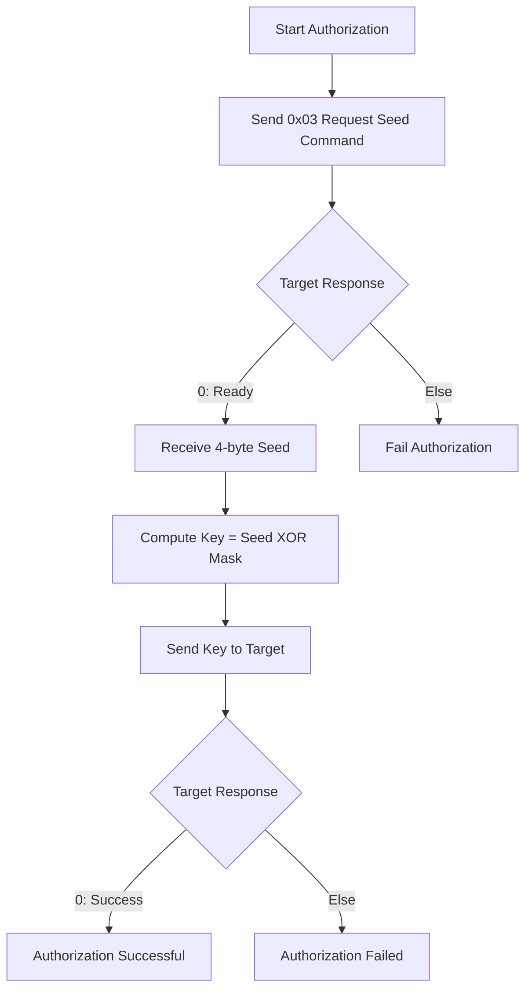
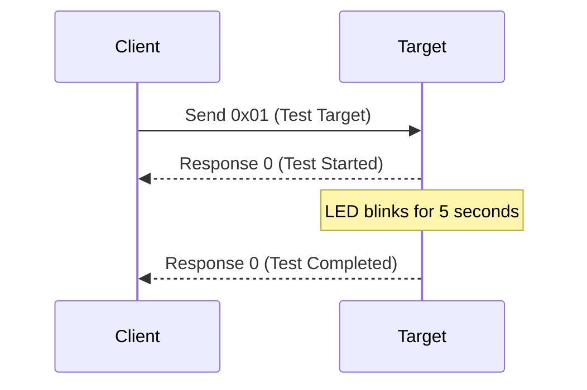
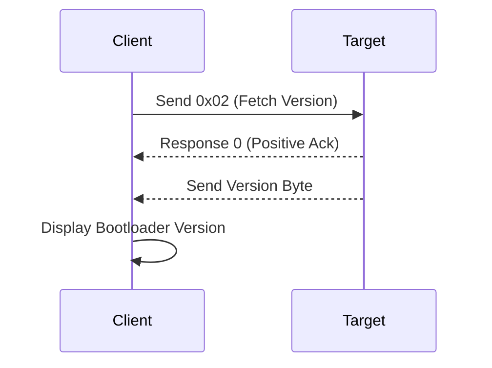

# 📘 Bootloader ClientApp

This project implements a **Python-based serial communication client** for interacting with a microcontroller bootloader.  
It supports **authorization**, **target testing**, **bootloader version fetching**, and **flashing the target**.

---

## ⚙️ Features

- **Authorization** using seed-key handshake  
- **Test Target** by blinking onboard LED  
- **Fetch Bootloader Version** from the device  
- **Menu-driven interface** for user interaction  
- **Serial communication** with configurable COM port and baud rate  

---

## 🔑 Authorization Flow

The client authenticates with the target using a **seed-key mechanism**:

