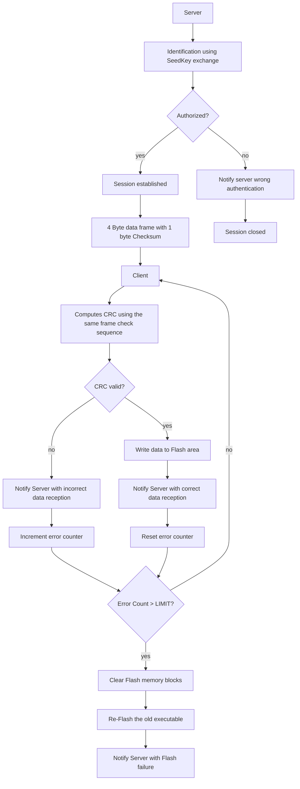

# BARE-MINIMUM BOOTLOADER FOR ARM M4 CPUS

> MOTIVATION

This project is a bare minimum bootloader implementation that acts as a Flasher for a ARM Cortex M4 CPU. The communication medium is selected as UART, as majority of Boards housing a cortex M4 have in-built USB-UART converters. Thus a personal computer could function as a server having the target cortex cpu as the client. Also, the server application could be easily written using Python serial library.
Server and client communication is authorized using a simple SeedKey algorithm and each message interaction is validated using via checksum.
The goal of this project : 
* appreciate the Flash memory updation schedules of a cortex M4 cpu.
* develop startup routine and linker script for cortex M4 architecture.
* develop a very simple custom bootloader protocol for robust communication between server and client

 

> HARDWARE USED

1. STM NUCLEO F446RE board as the client
2. A computer acting as a server

 

> CPU SPECIFICATIONS
### STM NUCLEO F446RE
|----------|--------------------|
|Core|Arm® 32-bit Cortex®-M4 CPU with FPU and Adaptive Real-Time Accelerator (ART Accelerator)|
|Max Clock Frequency|180 MHz|
|RAM|128 KB SRAM|
|FLASH|512 KB|
|FLASH SEGMENTS|Sector 0 - 7 : [16KB, 16KB, 16KB, 16KB, 16KB, 128KB, 128KB, 128KB]|

Flash memory segments are used as follows
* Sector 0 : 16KB Custom minimal bootloader
* Sector 1 - 5 : 192KB Area for Primary flash contents
* Sector 6 & 7 : 256KB Area for backup flash

 

> SOME PRE-REQUISITE INFORMATION

#### INTEL HEX
ARM compiler arm-gcc-none-eabi builds executables as an ELF file, An ELF has many more information along with the code contents. When a bootloader copies data to the flash area of a cpu, it only requires the flash contents. Hence, during the build process, we convert the elf to intel hex format and archive using the objcopy binary.

`arm-none-eabi-objcopy -S -O ihex <elfname> <ihexname>`  
Here `-S` strips the debug information

**Segments of ihex format**
1. Start Code : `:`
2. Byte Count (1byte) : Specifies the byte(s) of data to follow in data field
3. Address field (2bytes) : 16-bit beginning memory address offset
4. Record type (1byte) : 00 - Data, 01 - End of File, 02 - Extended Segment Address, 03 - Start Segment Address, 04 - Extended Linear Address, 05 - Start Linear Address
5. Data (nbytes) : n bytes of data
6. Checksum (1byte)

For an embedded CPU, the record types is either, Data or End of File. *(First Line of the hex file which defines the base address has record type 04)*

**Checksum algorithm used in ihex**
e.g. record - :0300300002337A1E  computed checksum 1E  
sum bytes of record and store LSB - 0x03 + 0x00 + 0x30 + 0x00 + 0x02 + 0x33 + 0x7A = 0x00E2 (lsb = E2)  
Checksum = 2's complement of lsb = 0x1E  

 

**HEX Parser**
To extract flash content from the hex file we do the following,
* Ignore the 1st and last lines. 1st line of hex file contains starting base address. However, our flash placement address is already known *(As described in the CPU SPECIFICATION segment)*. Similarly the last line with record type 01 is not flash content.
* Compute checksum of individual data record and verify the calculated checksum is correct for all data fields. If there is a mismatch, hex file is corrupted.
* Ignore first 9 characters of a data entry which contains start code, byte count, address field, record type. Ignore the checksum of each data record. Append the data part of each record in an array.
* Final array is the binary that needs to be written on to the target flash area starting from the designated start address.

 

## IMPLEMENTATION

Following numbered segments describe the progress of this project. 
We strongly recommend to follow the flow of work to re-create the project at own's capacity and appreciate each aspect of the project.

> 1. SETUP BUILD FRAMEWORK

> BOOTFLOW

 

> DATA VALIDITY

Data validity check is done by CRC. 
Sender operates on flash file data on a 3 byte block with a frame check sequence of 1 byte length returning a 4 byte block of data.
Receiver receives (data + CRC remainder), re-computes CRC, validates if the remainder is zero confirming data validity.

> CLIENT CONTROL FLOW

> FLASH MEMORY ORGANIZATION FOR LINKER

 

